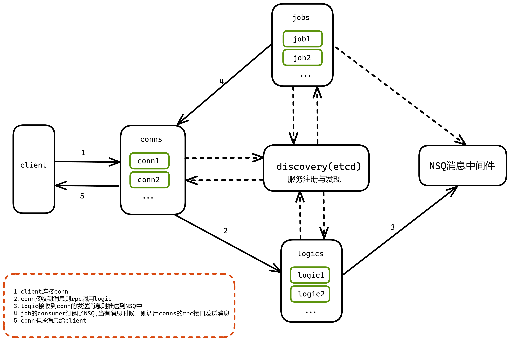

## 聊天室（消息转发）
### 项目目录
```
api:        proto文件
cmd:        服务启动入口
internal:   每个服务的私有代码
pkg :       共享代码
test:       测试脚本
```
### 技术

通讯框架：GRPC  
长连接通讯协议：Protocol Buffers    
日志框架：Zap   
消息中间件：NSQ 

### 日志
在cmd文件下，每个服务文件见内都有log文件夹，日志文件为live.log

### 前端接入
- websocket通讯
```
    地址：ws://{ip:port}/room
    
    步骤：
    1.发送登录请求Rep{type:1,}结构，如果收到Reply{type:0},则代表错误，需要获取Reply.data的错误信息，data对应的是Err格式
    2.登录成功，定时发送心跳,服务器返回Reply{type:2,data:{字符串pong}}
    3.收发信息；发Rep{type:3,data:{...}},收Reply{type:3,data:{...}}
```
- api接口
```
    1.重要消息推送接口:http://{ip:port}/msg  [post]
    请求参数：
        header : Authorization
        body : {
            room_id : "群id（字符串）",
            msg :   "消息（字符串，前端自定义json字符串格式）",
        }
    返回结构：
        {
            code : 0|1|1001, 0错误， 1正常， 1001请登录
            msg :   ""
        }
    2.测试用获取token:http://{ip:port}/tk [post]
    请求参数:
        body : {
            uid : ""
        }
    返回结构:
        {
            code : 0 | 1, 0错误， 1正常
            msg : "",
            data : "token字符串"
        }

```

### 与前端交互(proto buf)
- 前端需要编写*.proto文件，并使用protobuf.js文件处理。    
- 相关资料：https://juejin.cn/post/6844903699458818062
- protobuf.js:https://github.com/protobufjs/protobuf.js 
```
    //消息类型
    enum PackageType {
        UNKNOWN = 0; // 未知，与Err格式配合使用
        SIGN_IN = 1; // 登录
        HEARTBEAT = 2; // 心跳
        MESSAGE = 3; // 消息投递
        MEMBERS = 4; //获取在线人数
    }

    enum MsgLevel {
        NORMAL = 0;//普通消息
        IMPORTANT = 1;//重要消息 (例如：红包，下单等)
    } 

    //发送ws消息格式
    message Req {
        PackageType type = 1;//类型
        bytes data = 2;
    }

    //返回格式
    message Reply{
        PackageType type =1;
        bytes data = 2;
    }

    //错误格式
    message Err{
        int32 code = 1;//错误码 0 代表ok 100需要登录
        string msg = 2;//错误信息
    }

    //登录格式
    message SignIn {
        string token = 1;
        string roomID = 2;
    }
    
    //发送消息格式
    message BroadcastRoomReq {
        string roomID = 1;
        MsgLevel msgLv = 2;
        bytes data = 3; //前端自定义发送消息格式，例如{"type":1, "content":"test"}
    }
```

### 请求与返回格式
```
    ########## 请求 ##########
    //步骤：
            1.先根据type的类型所需的data打包
            2.然后再打包Req格式
            例如：
                1.登录需要把SignIn{roomID:"",token:""}打包成bytes => SignIndata
                2.然后放到Req{type:1, data:SignIndata},Req打包成bytes然后再发送
    //登录
    Req {
        type = 1
        data = {SignIn格式转为bytes}
    }

    //心跳
    Req {
        type = 2
        data = ""
    }
    
    //发送消息
    Req {
        type = 3
        data = {BroadcastRoomReq格式转为bytes}
    }

    //获取在线人数(建议每隔n秒获取一次)
    Req {
        type = 4
        data = ""
    }

    ########## 响应 ##########
    //步骤：
            1.先根据Reply格式解包
            2.然后根据Reply.Type类型，对Reply.Data解包
            例如：
                1.Reply解包为Reply{type:3,data:...}
                2.根据type为3，对Reply.Data用BroadcastRoomReq解包
    //返回成功或错误
    Reply {
        type = 0
        data = {Err转为bytes} 
    }

    //心跳
    Reply {
        type = 2
        data = "pong"
    }

    //在线人数
    Reply {
        type = 4
        data = "在线人数字符串" 
    }

    //消息推送

    Reply {
        type = 3
        data = {BroadcastRoomReq转为bytes} 
        //由于后端是合并发送，
        //所以BroadcastRoomReq.Data会存放1份或多份的消息
    }

    //BroadcastRoomReq.Data的组成
    // |headlen（默认4字节）:存放data的长度|data数据|
    // |headlen1|data1|headlen2|data2|....

    // 解包步骤
    1.先获取data前4个字节，得出data的长度dataLen
    2.根据dataLen获取data的内容。然后剩下的数据重新放到data中
    3.判断如果data的长度大于0，则重复以上步骤

```
### js 压包拆包
```
    var headLen = 4;//默认前4个字节存放包的长度

    //格式 => |5 0 0 0|112 97 99 107 49|
    //        |包长度 |     包内容      |
    var pack1 = pack("pack1");//包1
    //格式 => |10 0 0 0|105 32 97 109 32 112 97 99 107 50|
    //        | 包长度 |              包内容              |
    var pack2 = pack("pack2");//包2

    //格式 => |5 0 0 0|112 97 99 107 49|10 0 0 0|105 32 97 109 32 112 97 99 107 50|
     //       |包长度 |     包内容      | 包长度 |              包内容              |
    var d = mergeBuf(pack1, pack2);//合并之后的包


    //拆包
    unpack(d)

    //压包，str为字符串
    function pack(str) {
        //创建一个加密对象
		var textEc = new TextEncoder();
		//加密str => byte
		var packBody = textEc.encode(str);
		//创建一个headbuf,默认是headLen长度
		var headBuf = new ArrayBuffer(headLen);
		//创建dataview对象,offset为0
		var dv = new DataView(headBuf, 0);
		//存放pack的总长度, 默认用小端
		dv.setInt32(0,packBody.byteLength, true);
		//合并buff
		return mergeBuf(headBuf, packBody);
    }

    //拆包
	function unpack(data) {
		//创建解析对象
		var textDec = new TextDecoder();
		//创建dataview对象,offset为0
		var dv = new DataView(data, 0);
		
		var offset = headLen;
		//先获取第一个包的包长度
		var packLen = dv.getUint8(0);//等于使用 new Int32Array(d.slice(0, headLen))[0];

		while  (true) {
			console.log(textDec.decode(data.slice(offset, offset+packLen)));
			offset += packLen;
			if (offset >= data.byteLength) {
				return
			}
			packLen = dv.getUint8(offset);
			offset += headLen
		}
	}

    //合并buffer
	function mergeBuf(ab1, ab2) {
		var u81 = new Uint8Array(ab1);
		var u82 = new Uint8Array(ab2);
		var res = new Uint8Array(ab1.byteLength + ab2.byteLength);
		res.set(u81, 0);
		res.set(u82, ab1.byteLength);
		return res.buffer;
	}
```

### token
token文件在`pkg/token/token.go` 自行修改所需字段 


### 部署
1.自行安装etcd后, 运行`$ etcd`启动服务
2.自行安装nsq后, 运行`$ nsqd`启动服务     
2.在cmd目录下各个服务的toml配置修改对应的参数   
3.分别切换到cmd的conn，logic, job目录下，执行`go run .`  


### 服务介绍
1.conn  
维持与客户端的Websocket长连接，心跳，消息推送。开启多个节点则可以组成集群。   
2.logic     
验证token。开启多个节点可以组成集群。  
3.job   
消息推送。开启多个节点可以组成集群。    

### 结构
